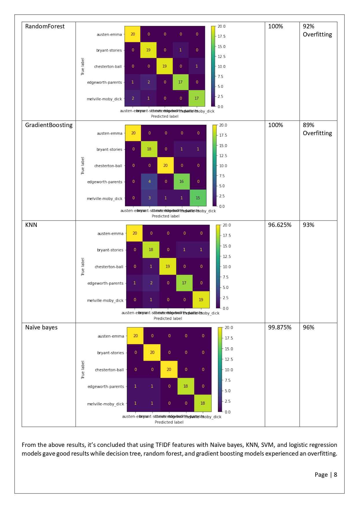

# Group 8 Data Science Applications Classification Assignment Project 
A simple and well designed structure is essential for any machine learning project, project template that combines **simplicity, best practice for CODE structure** and **good CODE design**. 
The main idea is that there's much same stuff you do every time when you start our machine learning project, so wrapping all this shared stuff will help you to change just the core idea every time you start our machine learning project. 

**So, here’s a simple readme template that help you get into our project faster and just focus on your notice and explainations, etc)**
------------------------------------------------------------------------------------------------------------------------------------------------------
In order to decrease repeated code shunks, increase the time that can read the code in, flexibility an reusability we used a functional programming structure that focused on split all problems in our project in functions and use that functions many times in many places in the code without repeating the code.

In this project, we selected some books from the Gutenburg library from different categories and then select random paragraphs from them and labeled these paragraphs by the book name for ground truth. After creating the dataset we used many transformation algorithms to embed the text to numbers for the modeling processes like (TF_IDF, BOW,NGRAM)
  
After this, we tried many classification algorithms like(SVM, KNN, Decision Tree, RandomForest Classifier,GradientBoosting,Naive Base and LogisticRegression) and chose the champion one which achieved the highest accuracy.

**Recommended using GPU to compile the code much faster.
But it works well for CPU too.**
- GPU takes around 40 min, while CPU may take hours.
 

# Requirements
- [numpy](https://numpy.org/) (The fundamental package for scientific computing with Python)
- [pandas](https://pandas.pydata.org/) (pandas is a fast, powerful, flexible and easy to use open source data analysis and manipulation tool, built on top of the Python programming language.) 
- [Pytorch-Transformers](https://pytorch.org/hub/huggingface_pytorch-transformers/) (High-level library to help with text augmentation using deep learning in PyTorch)
- [sklearn](https://scikit-learn.org/stable/) (TMachine Learning and Data Analysis Library in Python)
- [nltk](https://www.nltk.org/) (The fundamental package for Natural Language Procesing with Python)
- [matplotlib](https://matplotlib.org/) (Matplotlib is a comprehensive library for creating static, animated, and interactive visualizations in Python)
- [seaborn](https://seaborn.pydata.org/) (Seaborn is a Python data visualization library based on matplotlib. It provides a high-level interface for drawing attractive and informative statistical graphics.)

# Run the Code
- Upload the ipynb code file into "Google Colab" or Anaconda "Jupyter Notebook"
- Press "Run All" in the control panel or "Restart Kernel and Run All" to run all code 
- In case of run each code cell alone, press the run button that appear at each code cell
 tents
 
# Contributing
Any kind of enhancement or contribution is welcomed.

<embed src="Group8_ClassificationAssignment.pdf" type="application/pdf">

 
